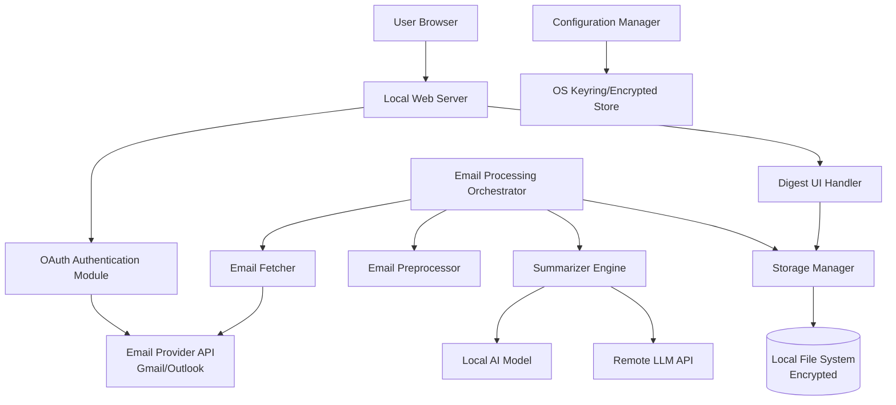

# Email Summarizer - Design Document

## Overview

The Email Summarizer is a privacy-focused local application that automates email triage by fetching emails via OAuth, cleaning content, generating AI summaries with actionable insights, and presenting them through a local web interface. The system is built with a modular architecture separating concerns: authentication, email fetching, preprocessing, summarization, storage, and presentation.

The application runs entirely on the user's machine with a local web server (default port 8080) and supports both Gmail and Outlook/Office365 providers. Users can choose between local AI models (fully private) or remote LLM services (higher quality) for summarization. All sensitive data including OAuth tokens and optionally email bodies are encrypted at rest.

## Architecture

### High-Level Architecture



### Technology Stack

- **Language**: Python 3.9+ (recommended for rich ecosystem)
- **Web Framework**: Flask or FastAPI for local web server
- **OAuth Libraries**: 
  - Gmail: `google-auth-oauthlib`, `google-api-python-client`
  - Outlook: `msal` (Microsoft Authentication Library)
- **HTML Processing**: `beautifulsoup4` for HTML to text conversion
- **Encryption**: `cryptography` library with Fernet symmetric encryption
- **Local AI**: `transformers` library with models like BART, Pegasus, or T5
- **Remote LLM**: `openai` SDK or similar for API access
- **Storage**: JSON files with optional SQLite index for metadata
- **Frontend**: Vanilla JavaScript with minimal CSS framework

### Design Principles

1. **Privacy First**: All data stored locally, encryption by default, read-only access
2. **Modularity**: Clear separation between fetching, processing, and presentation
3. **Configurability**: Support multiple providers and summarizer engines through configuration
4. **Fail-Safe**: Dry-run mode and graceful error handling prevent data loss
5. **Simplicity**: Minimal dependencies, straightforward deployment

## Components and Interfaces

### 1. Configuration Manager

**Responsibility**: Load, validate, and persist application configuration with secure credential storage.

**Interface**:
```python
class ConfigManager:
    def load_config() -> Config
    def save_config(config: Config) -> None
    def get_secret(key: str) -> str
    def set_secret(key: str, value: str) -> None
    def validate_config(config: Config) -> List[ValidationError]
```

**Configuration Schema**:
```yaml
email_provider: "gmail" | "outlook"
oauth:
  client_id_ref: "keyring:oauth_client_id"  # Reference to keyring
  client_secret_ref: "keyring:oauth_client_secret"
  redirect_uri: "http://localhost:8080/oauth2callback"
  scopes: ["gmail.readonly"]

fetch_rules:
  mode: "unread" | "last_n_days" | "all"
  max_messages: 20
  days_back: 7  # if mode is last_n_days

summarizer:
  engine: "local" | "remote"
  local_model: "facebook/bart-large-cnn"  # if engine is local
  remote_provider: "openai"  # if engine is remote
  remote_api_key_ref: "keyring:openai_api_key"
  max_input_tokens: 512

server:
  port: 8080
  host: "localhost"

storage:
  summaries_dir: "./summaries"
  encrypt_bodies: true
  use_sqlite_index: true

privacy:
  remote_llm_consent: false
  log_rotation_days: 7
```

### 2. OAuth Authentication Module

**Responsibility**: Handle OAuth 2.0 flow for Gmail and Outlook, manage token lifecycle.

**Interface**:
```python
class OAuthAuthenticator:
    def __init__(self, provider: str, config: OAuthConfig)
    def get_authorization_url() -> str
    def handle_callback(code: str) -> Credentials
    def refresh_token(credentials: Credentials) -> Credentials
    def is_token_valid(credentials: Credentials) -> bool
    def revoke_token(credentials: Credentials) -> None
```

**Token Storage**:
- Tokens stored in encrypted file: `~/.email-summarizer/tokens.enc`
- Encryption key derived from OS keyring or user-provided passphrase
- Token structure: `{provider, access_token, refresh_token, expiry, scopes}`

### 3. Email Fetcher

**Responsibility**: Retrieve emails from provider APIs based on fetch rules.

**Interface**:
```python
class EmailFetcher:
    def __init__(self, provider: str, credentials: Credentials)
    def fetch_emails(rules: FetchRules, dry_run: bool = False) -> List[RawEmail]
    def get_email_body(message_id: str) -> str
    def get_attachments_metadata(message_id: str) -> List[Attachment]
```

**RawEmail Data Model**:
```python
@dataclass
class RawEmail:
    message_id: str
    sender: str
    subject: str
    received_at: datetime
    body_html: str
    body_text: str  # if available
    attachments: List[Attachment]
    labels: List[str]
```

### 4. Email Preprocessor

**Responsibility**: Clean and normalize email content for summarization.

**Interface**:
```python
class EmailPreprocessor:
    def clean_email(raw_email: RawEmail) -> CleanedEmail
    def html_to_text(html: str) -> str
    def remove_quoted_replies(text: str) -> str
    def remove_signature(text: str) -> str
    def extract_main_content(text: str) -> str
```

**Cleaning Pipeline**:
1. Convert HTML to plain text (preserve paragraphs, remove tags)
2. Detect and remove quoted replies (lines starting with `>`, `On ... wrote:` patterns)
3. Detect and remove signatures (`--`, `Regards,`, contact blocks)
4. Normalize whitespace (collapse multiple newlines, trim)
5. Validate result is non-empty

**CleanedEmail Data Model**:
```python
@dataclass
class CleanedEmail:
    message_id: str
    sender: str
    subject: str
    received_at: datetime
    cleaned_body: str
    attachments: List[str]  # filenames only
    original_length: int
    cleaned_length: int
```

### 5. Summarizer Engine

**Responsibility**: Generate structured summaries from cleaned emails using AI.

**Interface**:
```python
class SummarizerEngine(ABC):
    @abstractmethod
    def summarize(email: CleanedEmail) -> EmailSummary
    
class LocalSummarizer(SummarizerEngine):
    def __init__(self, model_name: str, max_tokens: int)
    def summarize(email: CleanedEmail) -> EmailSummary
    
class RemoteSummarizer(SummarizerEngine):
    def __init__(self, provider: str, api_key: str, max_tokens: int)
    def summarize(email: CleanedEmail) -> EmailSummary
    def _retry_with_json_fix(email: CleanedEmail, error: str) -> EmailSummary
```

**Prompt Template**:
```
You are an email summarization assistant. Analyze the following email and produce a JSON object with these keys:
- "summary": 1-3 sentences describing the email's purpose and any requested next steps
- "actions": array of short action strings (what the recipient should do)
- "deadlines": array of ISO date strings (YYYY-MM-DD) or empty array if no deadlines

Email Details:
Subject: {subject}
From: {sender}
Date: {received_at}
Attachments: {attachment_list}

Email Body:
{cleaned_body}

Output only valid JSON. No additional text.
```

**EmailSummary Data Model**:
```python
@dataclass
class EmailSummary:
    message_id: str
    sender: str
    subject: str
    received_at: datetime
    summary: str
    actions: List[str]
    deadlines: List[date]
    created_at: datetime
    model_used: str
```

### 6. Storage Manager

**Responsibility**: Persist and retrieve email summaries with optional encryption.

**Interface**:
```python
class StorageManager:
    def __init__(self, config: StorageConfig)
    def save_summary(summary: EmailSummary) -> None
    def get_summary(message_id: str) -> Optional[EmailSummary]
    def list_summaries(limit: int = None, offset: int = 0) -> List[EmailSummary]
    def delete_summary(message_id: str) -> None
    def delete_all() -> None
    def save_feedback(message_id: str, feedback: Feedback) -> None
```

**Storage Structure**:
```
~/.email-summarizer/
├── config.yaml
├── tokens.enc
├── summaries/
│   ├── 2025-12-07_msg123.json
│   ├── 2025-12-07_msg456.json
│   └── index.db  # SQLite index (optional)
└── logs/
    └── app.log
```

**Summary JSON Format**:
```json
{
  "message_id": "msg123",
  "sender": "manager@company.com",
  "subject": "Q4 Budget Review",
  "received_at": "2025-12-07T10:30:00Z",
  "summary": "Manager requests updated Q4 budget numbers and asks for a 1-page summary by Friday.",
  "actions": [
    "Review 'Q4_budget.xlsx' and update revenue estimates",
    "Send 1-page summary to Manager"
  ],
  "deadlines": ["2025-12-12"],
  "created_at": "2025-12-07T11:00:00Z",
  "model_used": "gpt-4",
  "feedback": null
}
```

### 7. Email Processing Orchestrator

**Responsibility**: Coordinate the end-to-end email processing pipeline.

**Interface**:
```python
class EmailOrchestrator:
    def __init__(self, config: Config, fetcher: EmailFetcher, 
                 preprocessor: EmailPreprocessor, summarizer: SummarizerEngine,
                 storage: StorageManager)
    def process_emails(dry_run: bool = False) -> ProcessingResult
    def process_single_email(message_id: str) -> EmailSummary
```

**Processing Pipeline**:
1. Fetch emails based on rules
2. For each email:
   - Preprocess/clean content
   - Generate summary
   - Save to storage (unless dry-run)
3. Return processing statistics

### 8. Web Server and Digest UI

**Responsibility**: Serve local web interface for viewing summaries and managing settings.

**Endpoints**:
```
GET  /                          # Digest homepage
GET  /oauth2callback            # OAuth redirect handler
GET  /api/summaries             # List summaries (JSON)
GET  /api/summaries/:id         # Get single summary (JSON)
POST /api/summaries/:id/feedback # Submit feedback
POST /api/process               # Trigger email processing
POST /api/authorize             # Initiate OAuth flow
DELETE /api/data                # Erase all data
GET  /config                    # Configuration page
POST /api/config                # Update configuration
```

**Digest UI Features**:
- List view with sender, subject, summary preview
- Expandable detail view with full summary, actions, deadlines
- Feedback buttons (thumbs up/down)
- Filter by date, sender, has-actions, has-deadlines
- Dry-run mode toggle
- Process now button
- Settings panel

## Data Models

### Core Domain Models

```python
@dataclass
class Config:
    email_provider: str
    oauth: OAuthConfig
    fetch_rules: FetchRules
    summarizer: SummarizerConfig
    server: ServerConfig
    storage: StorageConfig
    privacy: PrivacyConfig

@dataclass
class Credentials:
    provider: str
    access_token: str
    refresh_token: str
    expiry: datetime
    scopes: List[str]

@dataclass
class RawEmail:
    message_id: str
    sender: str
    subject: str
    received_at: datetime
    body_html: str
    body_text: str
    attachments: List[Attachment]
    labels: List[str]

@dataclass
class CleanedEmail:
    message_id: str
    sender: str
    subject: str
    received_at: datetime
    cleaned_body: str
    attachments: List[str]
    original_length: int
    cleaned_length: int

@dataclass
class EmailSummary:
    message_id: str
    sender: str
    subject: str
    received_at: datetime
    summary: str
    actions: List[str]
    deadlines: List[date]
    created_at: datetime
    model_used: str
    feedback: Optional[Feedback] = None

@dataclass
class Feedback:
    rating: int  # 1 for thumbs up, -1 for thumbs down
    comment: Optional[str]
    created_at: datetime

@dataclass
class ProcessingResult:
    total_fetched: int
    total_processed: int
    total_failed: int
    dry_run: bool
    errors: List[ProcessingError]
```


## Correctness Properties

*A property is a characteristic or behavior that should hold true across all valid executions of a system—essentially, a formal statement about what the system should do. Properties serve as the bridge between human-readable specifications and machine-verifiable correctness guarantees.*

### Property 1: Encryption round-trip consistency
*For any* sensitive data (OAuth tokens, API keys, email bodies), encrypting and then decrypting should produce the original value, and the encrypted form should not be readable as plaintext.
**Validates: Requirements 1.3, 2.2, 2.4, 6.2, 8.2**

### Property 2: Configuration persistence
*For any* valid configuration value, saving to the configuration file and then loading should preserve the exact value.
**Validates: Requirements 2.3**

### Property 3: Fetch rule filtering
*For any* set of fetch rules and any collection of emails, the fetched results should contain only emails that match all specified rules (unread status, date range, etc.).
**Validates: Requirements 3.1, 3.2**

### Property 4: Fetch limit enforcement
*For any* maximum message limit N and any collection of available emails, the number of fetched emails should be less than or equal to N.
**Validates: Requirements 3.3**

### Property 5: Required field extraction
*For any* fetched email, the resulting RawEmail object should contain non-null values for message_id, sender, subject, received_at, and body content.
**Validates: Requirements 3.4**

### Property 6: Dry-run has no side effects
*For any* operation executed in dry-run mode, no files should be created, no API calls that modify state should be made, and no data should be persisted.
**Validates: Requirements 3.5, 9.1, 9.2, 9.4**

### Property 7: HTML to text preserves structure
*For any* HTML email body, converting to plain text should remove all HTML tags while preserving paragraph breaks and readable text content.
**Validates: Requirements 4.1**

### Property 8: Content cleaning removes noise
*For any* email body containing quoted replies (lines starting with >) or signature blocks (delimiters like --), the cleaned version should not contain these sections.
**Validates: Requirements 4.2, 4.3**

### Property 9: Attachment metadata preservation
*For any* email with N attachments, the processed email should contain exactly N attachment filenames in the metadata.
**Validates: Requirements 4.4**

### Property 10: Summarizer receives structured input
*For any* cleaned email, the prompt sent to the summarizer should contain all required fields: subject, sender, date, attachments list, and cleaned body.
**Validates: Requirements 5.1**

### Property 11: Summary output structure validation
*For any* valid summarizer response, parsing should produce a JSON object containing exactly three keys: "summary" (string), "actions" (array), and "deadlines" (array).
**Validates: Requirements 5.2**

### Property 12: Input truncation respects limits
*For any* input text longer than the model's maximum token limit, the truncated version should have a token count less than or equal to the limit.
**Validates: Requirements 5.4**

### Property 13: Summary persistence round-trip
*For any* generated EmailSummary, saving to storage and then retrieving by message_id should produce an equivalent EmailSummary with all fields preserved.
**Validates: Requirements 6.1**

### Property 14: File naming consistency
*For any* saved summary, the filename should follow the pattern `YYYY-MM-DD_<message_id>.json` and be located in the configured summaries directory.
**Validates: Requirements 6.3**

### Property 15: Digest displays all summaries
*For any* set of stored summaries, requesting the digest page should return HTML containing all summaries with their sender, subject, and summary text.
**Validates: Requirements 7.1**

### Property 16: Summary display completeness
*For any* EmailSummary rendered in the digest, the HTML should contain the sender, subject, summary text, all action items as list elements, and all deadlines.
**Validates: Requirements 7.2**

### Property 17: Email links are valid
*For any* email displayed in the digest, the HTML should contain a valid link (mailto: or provider-specific URL) that references the original message_id.
**Validates: Requirements 7.3**

### Property 18: Feedback UI presence
*For any* summary displayed when feedback is enabled, the rendered HTML should contain both thumbs-up and thumbs-down interactive elements.
**Validates: Requirements 7.4**

### Property 19: Feedback persistence round-trip
*For any* feedback submission with message_id and rating, storing and then retrieving the feedback should preserve the rating and associate it with the correct message_id.
**Validates: Requirements 7.5**

### Property 20: Dry-run provides preview statistics
*For any* dry-run operation, the result should include statistics about how many emails would have been fetched, processed, and summarized.
**Validates: Requirements 9.3**

### Property 21: Retry backoff increases delays
*For any* sequence of retry attempts due to rate limiting, each subsequent retry should wait longer than the previous retry (exponential backoff).
**Validates: Requirements 10.2**

### Property 22: Errors produce logs and user messages
*For any* error that occurs during processing, the system should write detailed information to the log file and return a user-friendly error message.
**Validates: Requirements 10.5**

## Error Handling

### Error Categories and Strategies

**1. Authentication Errors**
- Token expired/revoked: Prompt re-authentication, preserve partial work
- Invalid credentials: Clear error message with setup instructions
- Network timeout during OAuth: Retry with exponential backoff (max 3 attempts)

**2. Email Provider API Errors**
- Rate limiting (429): Exponential backoff starting at 1s, max 60s
- Quota exceeded: Notify user, suggest reducing fetch limit
- Invalid message ID: Log warning, skip message, continue processing
- Network errors: Retry up to 3 times, then queue for later

**3. Summarization Errors**
- JSON parsing failure: Retry once with "fix JSON" instruction
- Model timeout: Reduce input length, retry once
- API key invalid: Clear error, prompt for new key
- Model unavailable: Queue email, notify user, continue with others

**4. Storage Errors**
- Disk full: Alert user, stop processing, preserve existing data
- Permission denied: Clear error with directory path
- Encryption key missing: Prompt for key or re-initialization
- Corrupted file: Log error, skip file, continue

**5. Configuration Errors**
- Invalid config format: Use defaults, warn user
- Missing required fields: Prompt for values
- Invalid provider selection: List valid options

### Error Recovery Patterns

**Graceful Degradation**:
- If summarization fails, store cleaned email for manual review
- If storage fails, keep summaries in memory and retry
- If UI fails to load, provide CLI fallback

**Transactional Processing**:
- Process emails one at a time
- Commit each summary independently
- Failed email doesn't block others

**User Notification**:
- Real-time progress updates in UI
- Error notifications with actionable suggestions
- Success/failure summary after batch processing

## Testing Strategy

### Unit Testing

Unit tests will verify specific examples, edge cases, and component integration:

**Configuration Manager**:
- Loading valid and invalid config files
- Keyring integration for secret storage
- Config validation with missing/invalid fields

**OAuth Authenticator**:
- Authorization URL generation for Gmail and Outlook
- Token exchange with mock provider responses
- Token refresh logic

**Email Preprocessor**:
- HTML to text conversion with various HTML structures
- Quote removal with different quote patterns
- Signature detection with common formats
- Empty body handling

**Storage Manager**:
- File creation and retrieval
- Directory structure creation
- Encryption/decryption with test keys

**Web Server**:
- Endpoint routing
- Request/response handling
- Error responses

### Property-Based Testing

Property-based tests will verify universal properties across all inputs using the **Hypothesis** library for Python (minimum 100 iterations per property):

**Testing Framework**: Hypothesis (Python)
- Minimum iterations: 100 per property
- Each test must reference its design property using format: `# Feature: email-summarizer, Property N: <property text>`

**Key Properties to Test**:

1. **Encryption Properties** (Property 1):
   - Generate random tokens, API keys, email bodies
   - Verify encrypt→decrypt returns original
   - Verify encrypted form differs from plaintext

2. **Configuration Properties** (Property 2):
   - Generate random valid config values
   - Verify save→load preserves values

3. **Fetch Filtering Properties** (Properties 3, 4, 5):
   - Generate random email collections with varied attributes
   - Generate random fetch rules
   - Verify results match rules and respect limits
   - Verify all required fields present

4. **Dry-Run Properties** (Property 6, 20):
   - Generate random operations
   - Verify no files created in dry-run
   - Verify statistics are returned

5. **Preprocessing Properties** (Properties 7, 8, 9):
   - Generate random HTML content
   - Generate emails with/without quotes and signatures
   - Verify cleaning removes noise
   - Verify attachment counts preserved

6. **Summarization Properties** (Properties 10, 11, 12):
   - Generate random cleaned emails
   - Verify prompts contain all fields
   - Verify output structure is valid JSON with required keys
   - Verify truncation respects limits

7. **Storage Properties** (Properties 13, 14):
   - Generate random EmailSummary objects
   - Verify save→load round-trip
   - Verify filename conventions

8. **UI Properties** (Properties 15, 16, 17, 18):
   - Generate random summary collections
   - Verify all summaries appear in digest
   - Verify required fields in HTML
   - Verify links are well-formed

9. **Feedback Properties** (Property 19):
   - Generate random feedback submissions
   - Verify save→retrieve round-trip

10. **Error Handling Properties** (Properties 21, 22):
    - Generate random error conditions
    - Verify retry delays increase
    - Verify logs and messages are created

**Generator Strategies**:
- Email generators: random subjects, senders, dates, bodies with HTML
- Config generators: valid provider names, ports, paths
- HTML generators: nested tags, attributes, text content
- Error generators: various exception types and API error codes

### Integration Testing

Integration tests will verify end-to-end workflows:

1. **OAuth Flow**: Mock provider → authorization → token storage → API access
2. **Email Processing Pipeline**: Fetch → Clean → Summarize → Store
3. **Web Interface**: Start server → Load digest → Display summaries → Submit feedback
4. **Dry-Run Mode**: Enable dry-run → Process → Verify no persistence
5. **Error Recovery**: Inject failures → Verify retry logic → Verify partial success

### Manual Testing Checklist

- [ ] OAuth flow with real Gmail account
- [ ] OAuth flow with real Outlook account
- [ ] Fetch 10 unread emails and verify summaries
- [ ] Test dry-run mode shows preview without saving
- [ ] Verify encrypted token storage
- [ ] Test digest UI displays all summaries correctly
- [ ] Submit feedback and verify persistence
- [ ] Test data erasure removes all files
- [ ] Verify rate limiting triggers backoff
- [ ] Test with local model (if available)
- [ ] Test with remote LLM (OpenAI)

## Security Considerations

### Data Protection

1. **Encryption at Rest**:
   - All OAuth tokens encrypted with Fernet (symmetric encryption)
   - Optional email body encryption
   - Encryption keys stored in OS keyring or derived from user passphrase

2. **Minimal Permissions**:
   - Request only `gmail.readonly` or `Mail.Read` scopes
   - No write/delete permissions by default
   - User must explicitly enable modify scopes if needed

3. **Local-Only Storage**:
   - All data stored on user's machine
   - No cloud sync or external storage
   - User controls data lifecycle

4. **Secret Management**:
   - OAuth client secrets in keyring, not plaintext
   - API keys encrypted in config
   - `.gitignore` prevents accidental commits

### Privacy Considerations

1. **Consent for Remote LLM**:
   - Explicit consent required before sending emails to third-party
   - Consent stored in config
   - Warning displayed in UI

2. **Data Minimization**:
   - Store only necessary metadata
   - Optional: don't store raw email bodies
   - Configurable retention period

3. **Audit Trail**:
   - Log all API calls (without sensitive data)
   - Track which emails were sent to remote services
   - User can review audit log

### Threat Model

**In Scope**:
- Protecting tokens from local file access
- Preventing accidental credential exposure
- Securing data at rest

**Out of Scope**:
- Protection against malware with root access
- Network traffic interception (relies on HTTPS)
- Physical access to unlocked machine

## Deployment and Operations

### Installation

1. Install Python 3.9+
2. Create virtual environment: `python -m venv venv`
3. Activate: `source venv/bin/activate` (Unix) or `venv\Scripts\activate` (Windows)
4. Install dependencies: `pip install -r requirements.txt`
5. Run setup: `python -m email_summarizer setup`
6. Configure OAuth credentials in config file
7. Start server: `python -m email_summarizer serve`

### Configuration

Initial setup wizard will prompt for:
- Email provider (Gmail/Outlook)
- OAuth client ID and secret
- Summarizer choice (local/remote)
- API key (if remote)
- Server port
- Storage location

### Monitoring

- Application logs in `~/.email-summarizer/logs/`
- Processing statistics in digest UI
- Error notifications in UI
- Health check endpoint: `GET /health`

### Maintenance

- Log rotation: automatic after 7 days
- Summary cleanup: manual or scheduled
- Token refresh: automatic
- Config updates: via UI or manual file edit

## Future Enhancements

1. **Scheduling**: Cron-like scheduling for automatic processing
2. **Filters**: Custom rules for which emails to process
3. **Labels**: Apply labels back to mailbox based on summary
4. **Search**: Full-text search across summaries
5. **Export**: Export summaries to CSV, PDF, or email
6. **Multi-Account**: Support multiple email accounts
7. **Mobile UI**: Responsive design for mobile browsers
8. **Notifications**: Desktop notifications for high-priority emails
9. **Custom Prompts**: User-defined summarization prompts
10. **Analytics**: Trends and insights from email patterns
